# NutriVision AI – System Architecture Document

**Version:** 1.0  
**Project Name:** NutriVision AI – AI-Based Vitamin Deficiency Identification and Nutrition Recommendation System  
**Status:** Architectural Baseline / Approved Blueprint  
**Classification:** Educational Prototype & AI-Assisted Preliminary Assessment System  

---

## 1. Executive Architecture Overview

NutriVision AI is built on a modern, decoupled **three-tier micro-service architecture** designed to deliver high responsiveness, strict separation of concerns, and robust security.

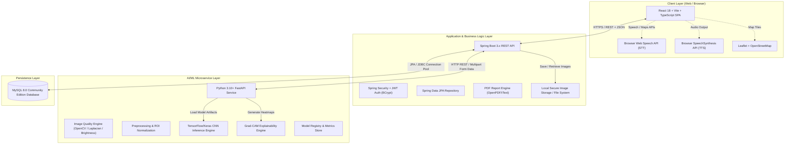

### Safety and Non-Diagnostic Architectural Boundary

> [!IMPORTANT]
> **Core Architectural Invariant:**
> 1. All prediction outputs leaving the AI Service and Spring Boot Backend are explicitly tagged as **`model_confidence`** and categorized as **preliminary indicators**, never medical diagnoses.
> 2. Every assessment response structure mandatorily includes the global **`medical_disclaimer`** payload.
> 3. Predictions never claim medical certainty; risk levels are designated as **Low concern**, **Moderate concern**, or **Needs medical evaluation**.

---

## 2. Component Architectures

### 2.1 Frontend Architecture (React + Vite + TypeScript)

The frontend is a Single Page Application (SPA) optimized for fast load times, modularity, and accessibility.

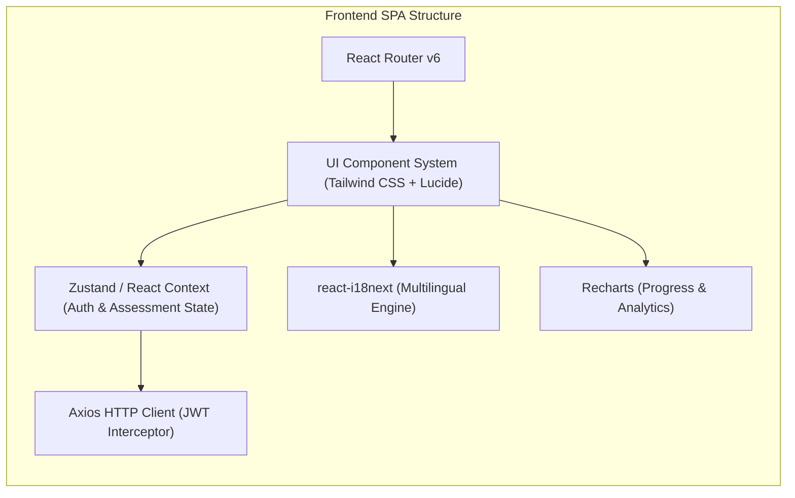

#### Key Frontend Modules:
- **Routing & Guards:** Role-based route gating (`PublicRoute`, `ProtectedRoute`, `AdminRoute`).
- **State Management:** Lightweight centralized state for authentication tokens, active assessment session, multi-step wizard state, and user preferences.
- **Multilingual Support (i18n):** `i18next` externalized translation bundles supporting English, Kannada, Hindi, Telugu, and Tamil.
- **Accessibility Layer:** Native browser speech-to-text integration (`webkitSpeechRecognition`/`SpeechRecognition`) and text-to-speech (`speechSynthesis`).
- **Data Visualization:** `Recharts` for historical risk trends, confidence distribution, and admin demographic analysis.
- **Mapping Module:** `Leaflet` with OpenStreetMap tile layer for doctor/nutritionist referral suggestions without paid API keys.

---

### 2.2 Backend Architecture (Spring Boot 3.x)

The Spring Boot backend acts as the central business orchestrator, data guardian, and secure gateway.

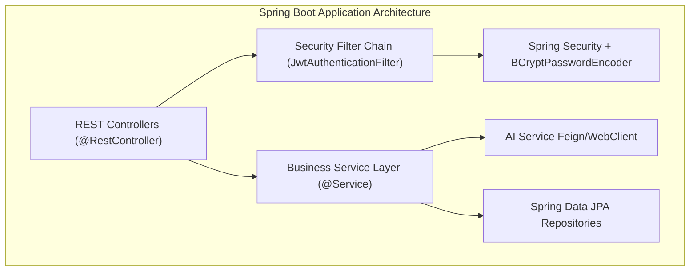

#### Core Backend Responsibilities:
1. **Security & Identity:** BCrypt password hashing (cost factor 12), stateless JWT token issue/validation, role-based authorization (`ROLE_USER`, `ROLE_ADMIN`).
2. **Assessment Orchestrator:** Manages multi-step assessment lifecycle: body part selection $\to$ image upload $\to$ symptom association $\to$ forwarding to AI service $\to$ persistence $\to$ recommendation aggregation.
3. **Recommendation Engine:** Rule-based recommendation matrix mapping deficiency classes to curated food datasets and 7-day nutrition plans, filtered by dietary preference (`VEGETARIAN`, `NON_VEGETARIAN`, `VEGAN`, `REGIONAL`).
4. **Report Generator:** Dynamic PDF assembly generating structured health summaries containing user data, symptoms, image thumbnails, predictions, recommendations, and prominent medical disclaimers.
5. **Admin & Auditing:** Comprehensive administrative endpoints for user management, system metrics, dataset tracking, model versioning, feedback triage, and audit logging.

---

### 2.3 AI/ML Microservice Architecture (Python + FastAPI)

The AI/ML service handles computer vision processing, image quality evaluation, deep learning inference, and explainability.

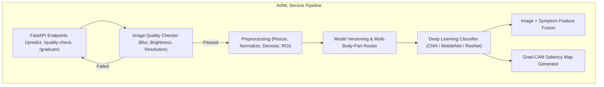

#### AI Service Features:
1. **Automated Quality Checking:** Pre-inference validation rejecting blurry (Laplacian variance $< \text{threshold}$), over/underexposed (histogram luminance checks), or undersized images with actionable feedback.
2. **Body Part Routing:** Dynamic routing based on selected target (`SKIN`, `EYES`, `TONGUE`, `LIPS`, `NAILS`, `HAIR`, `FACE`).
3. **Inference & Top-3 Prediction:** Softmax probability distribution extraction returning Top-3 candidate deficiencies with discrete `model_confidence` percentages.
4. **Explainability Engine (Grad-CAM):** Computes gradient-weighted class activation maps from the final convolutional layer, generating transparent heatmap overlays for user inspection.
5. **Model Registry:** Pluggable model loader allowing dynamic swapping of active model artifacts (`.h5`, `.keras`, `.onnx`) without restarting the backend.

---

## 3. Communication Protocols and Data Flow

### 3.1 Inter-Service Communication

| Channel | Protocol | Payload Type | Description |
|---|---|---|---|
| **Frontend $\leftrightarrow$ Backend** | HTTPS / REST | JSON / Multipart Form-Data | Client requests, authentication headers, image uploads, assessment results |
| **Backend $\leftrightarrow$ AI Service** | HTTP / REST (Internal) | Multipart Form-Data + JSON | Synchronous image forwarding, symptom vectors, inference results, Grad-CAM generation |
| **Backend $\leftrightarrow$ Database** | JDBC / TCP | SQL (HikariCP Connection Pool) | Relational persistence, transactional data access |

---

### 3.2 End-to-End Assessment Data Flow

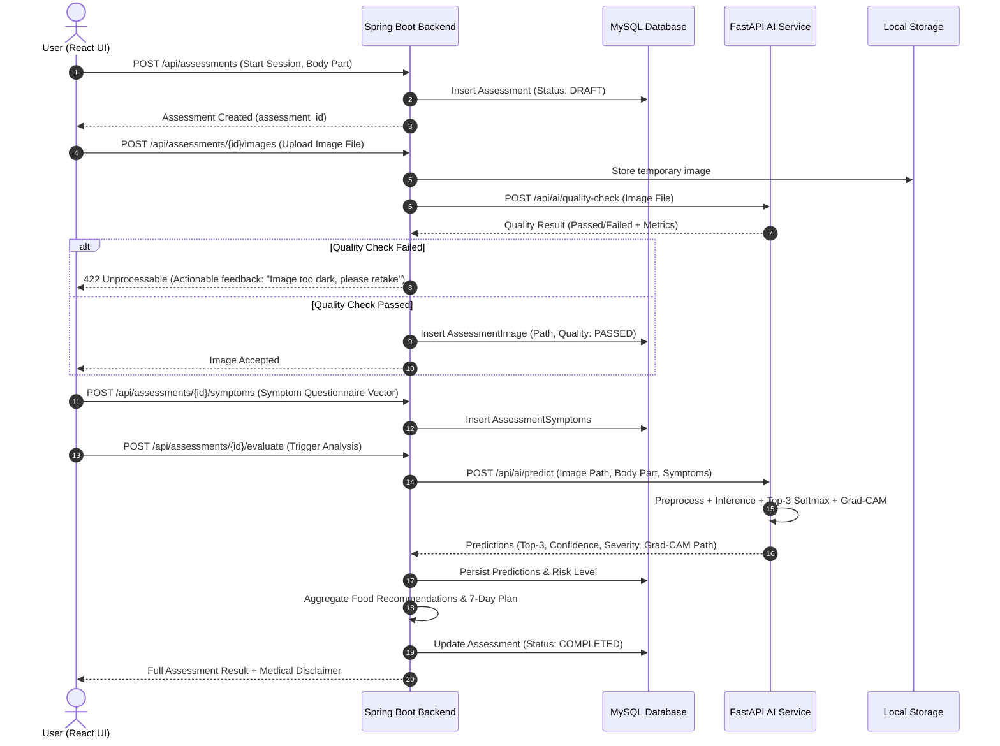

---

## 4. Authentication and Authorization Flow

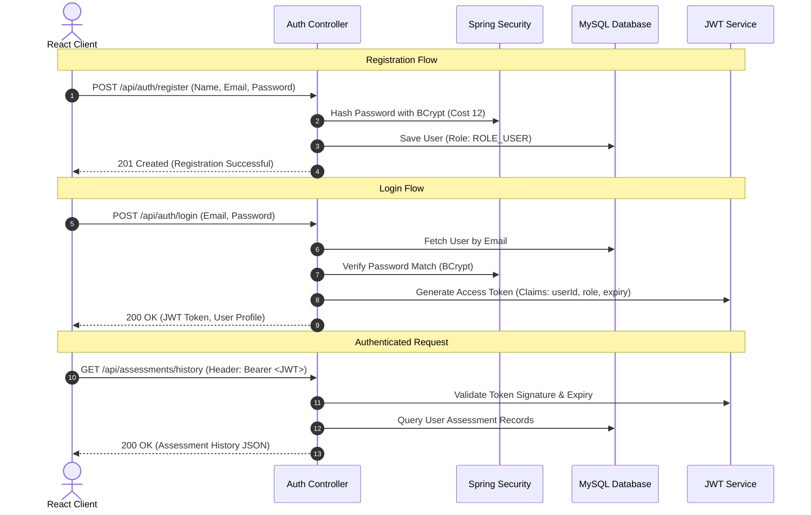

---

## 5. Image Processing and Preprocessing Pipeline

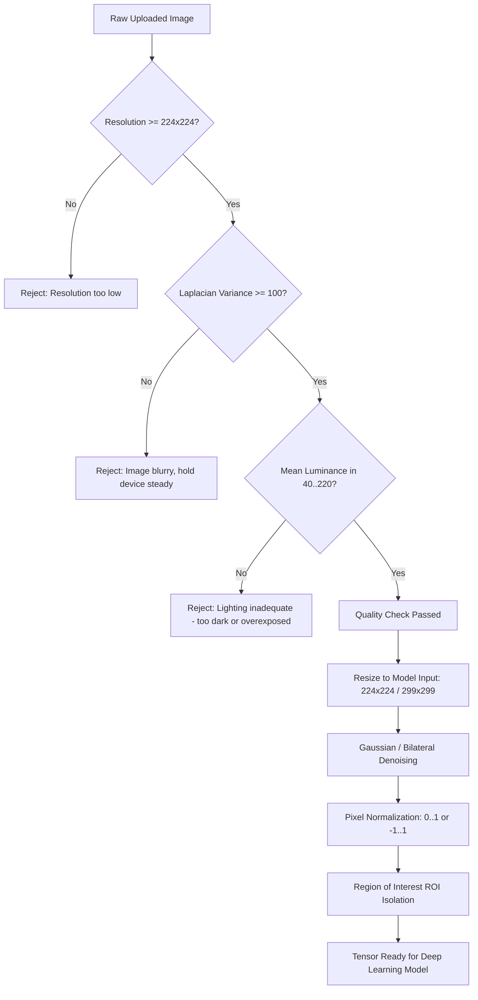

---

## 6. AI Inference, Prediction, and Explainability Pipeline

```mermaid
graph TD
    Tensor[Preprocessed Image Tensor] --> CNN[Trained CNN Backbone (e.g., MobileNetV2 / ResNet50)]
    SymptomVec[Structured Symptom Vector] --> DenseSym[Symptom Feature Layer]
    
    CNN --> FeatureVec[Visual Feature Vector]
    FeatureVec & DenseSym --> ConcatLayer[Feature Fusion Layer]
    ConcatLayer --> DenseHead[Classification Dense Head]
    DenseHead --> Softmax[Softmax Layer]
    
    Softmax --> ProbDist[Probability Distribution over Deficiency Classes]
    ProbDist --> Top3[Top-3 Ranked Predictions + Model Confidence %]
    
    CNN --> ConvLayer[Target Conv Layer Activations]
    ConvLayer & DenseHead --> GradCAMCompute[Grad-CAM Gradient Backprop]
    GradCAMCompute --> Heatmap[Saliency Heatmap Generation]
    Heatmap --> Overlay[Transparent Overlay on Source Image]
    
    Top3 --> SeverityLogic{Confidence & Class Mapping}
    SeverityLogic -->|Mild Indicators| RiskLow["Low Concern"]
    SeverityLogic -->|Moderate Indicators| RiskMod["Moderate Concern"]
    SeverityLogic -->|High/Multiple Indicators| RiskEval["Needs Medical Evaluation"]
```

---

## 7. Recommendation and Nutrition Planning Engine

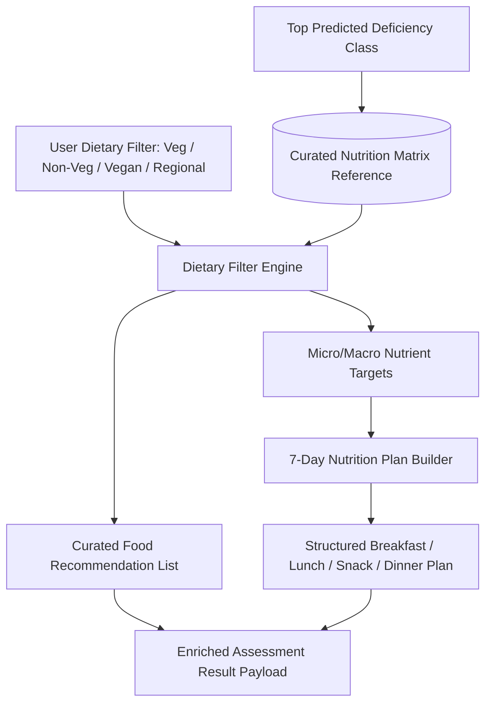

---

## 8. Admin Architecture and Auditing

The Admin sub-system provides role-gated capabilities (`ROLE_ADMIN`):

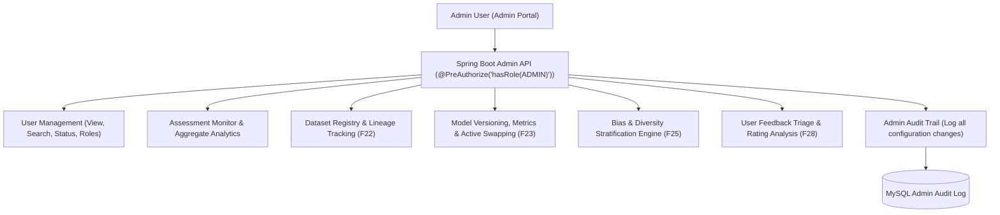

---

## 9. Security and Privacy Architecture

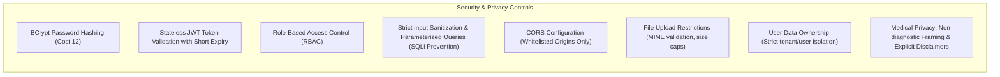

---

## 10. Future Deployment Architecture (Containerized & Cloud-Ready)

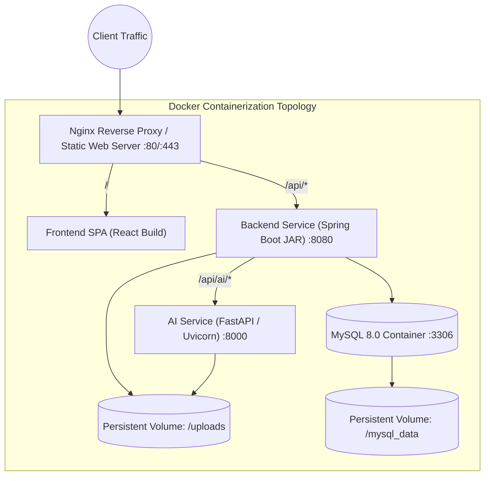

---

## 11. Architecture Quality Matrix

| Quality Attribute | Architectural Strategy | Verification Mechanism |
|---|---|---|
| **Modularity** | 3-tier decoupled services (React, Spring Boot, FastAPI) | Independent build and run cycles |
| **Safety & Compliance** | Mandatory disclaimers, Model Confidence terminology, non-diagnostic constraints | Automated API contract assertions |
| **Performance** | Asynchronous quality checks, lightweight CNN inference, indexed database queries | Single assessment $<5$ seconds |
| **Extensibility** | Pluggable model registry, externalized i18n dictionaries, modular recommendation rules | Zero-code active model swapping |
| **Security** | BCrypt, JWT, Spring Security RBAC, isolated file storage | Security penetration & auth regression tests |
| **Cost Efficiency** | 100% Free & Open Source Software (FOSS) stack | Zero paid API dependencies |
