# NutriVision AI – Database Design Document

**Project Name:** NutriVision AI – AI-Based Vitamin Deficiency Identification and Nutrition Recommendation System  
**Database Engine:** MySQL 8.0 Community Edition  
**Character Set:** `utf8mb4`  
**Collation:** `utf8mb4_unicode_ci`  
**Version:** 1.0  
**Status:** Architectural Baseline  

---

## 1. Entity-Relationship Diagram (Mermaid)

```mermaid
erDiagram
    USERS ||--o{ USER_ROLES : has
    ROLES ||--o{ USER_ROLES : assigned_to
    USERS ||--o| USER_PROFILES : has
    USERS ||--o{ ASSESSMENTS : initiates
    USERS ||--o{ CHATBOT_CONVERSATIONS : creates
    USERS ||--o{ FEEDBACK : submits
    USERS ||--o{ ADMIN_AUDIT_LOGS : performs

    ASSESSMENTS ||--o{ ASSESSMENT_IMAGES : contains
    ASSESSMENTS ||--o{ ASSESSMENT_SYMPTOMS : contains
    SYMPTOMS ||--o{ ASSESSMENT_SYMPTOMS : mapped_in
    ASSESSMENTS ||--o{ PREDICTIONS : produces
    ASSESSMENTS ||--o| NUTRITION_PLANS : receives
    ASSESSMENTS ||--o| HEALTH_REPORTS : generates
    ASSESSMENTS ||--o{ FEEDBACK : evaluated_by

    DATASET_SOURCES ||--o{ MODEL_VERSIONS : trained_with
    MODEL_VERSIONS ||--o{ PREDICTIONS : generates
    MODEL_VERSIONS ||--o{ MODEL_EVALUATIONS : evaluated_in

    CHATBOT_CONVERSATIONS ||--o{ CHATBOT_MESSAGES : contains

    USERS {
        bigint user_id PK
        varchar email UK
        varchar password_hash
        varchar full_name
        boolean is_active
        datetime created_at
        datetime updated_at
    }

    ROLES {
        int role_id PK
        varchar role_name UK
        varchar description
    }

    USER_ROLES {
        bigint user_id PK,FK
        int role_id PK,FK
    }

    USER_PROFILES {
        bigint profile_id PK
        bigint user_id FK
        varchar phone
        int age
        varchar gender
        varchar dietary_preference
        varchar preferred_language
        varchar city
        varchar country
        datetime updated_at
    }

    ASSESSMENTS {
        bigint assessment_id PK
        bigint user_id FK
        varchar target_body_part
        varchar status
        varchar severity_risk_level
        datetime created_at
        datetime completed_at
    }

    ASSESSMENT_IMAGES {
        bigint image_id PK
        bigint assessment_id FK
        varchar file_path
        varchar original_filename
        int file_size_bytes
        varchar mime_type
        varchar quality_status
        float blur_score
        float brightness_score
        varchar rejection_reason
        datetime uploaded_at
    }

    SYMPTOMS {
        int symptom_id PK
        varchar symptom_code UK
        varchar name
        varchar related_body_part
        varchar description
    }

    ASSESSMENT_SYMPTOMS {
        bigint assessment_id PK,FK
        int symptom_id PK,FK
    }

    PREDICTIONS {
        bigint prediction_id PK
        bigint assessment_id FK
        bigint model_version_id FK
        int rank_order
        varchar deficiency_category
        float model_confidence
        text gradcam_image_path
        datetime created_at
    }

    FOOD_RECOMMENDATIONS {
        bigint recommendation_id PK
        varchar deficiency_category
        varchar diet_type
        varchar food_item_name
        varchar rich_nutrient
        text serving_suggestion
        varchar regional_availability
    }

    NUTRITION_PLANS {
        bigint plan_id PK
        bigint assessment_id FK
        varchar primary_deficiency
        varchar diet_preference
        json weekly_meal_plan_json
        datetime created_at
    }

    HEALTH_REPORTS {
        bigint report_id PK
        bigint assessment_id FK
        varchar report_code UK
        varchar pdf_file_path
        text medical_disclaimer_text
        datetime generated_at
    }

    DOCTOR_REFERRALS {
        int referral_id PK
        varchar deficiency_category
        varchar specialist_type
        varchar description
    }

    FEEDBACK {
        bigint feedback_id PK
        bigint user_id FK
        bigint assessment_id FK
        int rating
        text comments
        datetime created_at
    }

    CHATBOT_CONVERSATIONS {
        bigint conversation_id PK
        bigint user_id FK
        bigint assessment_id FK
        varchar session_title
        datetime started_at
    }

    CHATBOT_MESSAGES {
        bigint message_id PK
        bigint conversation_id FK
        varchar sender
        text message_text
        datetime sent_at
    }

    DATASET_SOURCES {
        bigint dataset_id PK
        varchar name
        varchar version_tag
        varchar license_type
        int total_images
        varchar body_parts_covered
        text source_url
        datetime registered_at
    }

    MODEL_VERSIONS {
        bigint model_version_id PK
        bigint dataset_id FK
        varchar version_tag UK
        varchar architecture_type
        varchar model_file_path
        boolean is_active
        float test_accuracy
        float test_loss
        datetime created_at
    }

    MODEL_EVALUATIONS {
        bigint eval_id PK
        bigint model_version_id FK
        varchar evaluation_slice
        float slice_accuracy
        float slice_precision
        float slice_recall
        float slice_f1
        text metrics_json
        datetime evaluated_at
    }

    ADMIN_AUDIT_LOGS {
        bigint log_id PK
        bigint admin_user_id FK
        varchar action_type
        varchar target_entity
        varchar target_entity_id
        text details_json
        varchar ip_address
        datetime timestamp
    }
```

---

## 2. Entity Specifications and Data Dictionary

### 2.1 Core User & Security Tables

#### `users`
- **Purpose:** Manages core credentials and account status.
- **Columns:**
  - `user_id` BIGINT AUTO_INCREMENT PRIMARY KEY
  - `email` VARCHAR(255) NOT NULL UNIQUE (indexed)
  - `password_hash` VARCHAR(255) NOT NULL (BCrypt hash)
  - `full_name` VARCHAR(150) NOT NULL
  - `is_active` BOOLEAN NOT NULL DEFAULT TRUE
  - `created_at` DATETIME NOT NULL DEFAULT CURRENT_TIMESTAMP
  - `updated_at` DATETIME NOT NULL DEFAULT CURRENT_TIMESTAMP ON UPDATE CURRENT_TIMESTAMP

#### `roles` & `user_roles`
- **Purpose:** RBAC mapping for `ROLE_USER` and `ROLE_ADMIN`.
- **Columns:**
  - `role_id` INT AUTO_INCREMENT PRIMARY KEY
  - `role_name` VARCHAR(50) NOT NULL UNIQUE (`ROLE_USER`, `ROLE_ADMIN`)
  - `description` VARCHAR(255)

#### `user_profiles`
- **Purpose:** Extended health and preference metadata.
- **Columns:**
  - `profile_id` BIGINT AUTO_INCREMENT PRIMARY KEY
  - `user_id` BIGINT NOT NULL UNIQUE, FK $\to$ `users(user_id)` ON DELETE CASCADE
  - `phone` VARCHAR(25) NULL
  - `age` INT NULL
  - `gender` VARCHAR(20) NULL (`MALE`, `FEMALE`, `OTHER`, `PREFER_NOT_TO_SAY`)
  - `dietary_preference` VARCHAR(50) NOT NULL DEFAULT 'ANY' (`VEGETARIAN`, `NON_VEGETARIAN`, `VEGAN`, `REGIONAL`)
  - `preferred_language` VARCHAR(10) NOT NULL DEFAULT 'en' (`en`, `kn`, `hi`, `te`, `ta`)
  - `city` VARCHAR(100) NULL
  - `country` VARCHAR(100) NULL DEFAULT 'India'

---

### 2.2 Assessment & Clinical Indicator Tables

#### `assessments`
- **Purpose:** Master session record for each vitamin deficiency assessment workflow.
- **Columns:**
  - `assessment_id` BIGINT AUTO_INCREMENT PRIMARY KEY
  - `user_id` BIGINT NOT NULL, FK $\to$ `users(user_id)` ON DELETE CASCADE
  - `target_body_part` VARCHAR(50) NOT NULL (`SKIN`, `EYES`, `TONGUE`, `LIPS`, `NAILS`, `HAIR`, `FACE`)
  - `status` VARCHAR(30) NOT NULL DEFAULT 'DRAFT' (`DRAFT`, `QUALITY_PASSED`, `PROCESSING`, `COMPLETED`, `REJECTED`)
  - `severity_risk_level` VARCHAR(50) NULL (`LOW_CONCERN`, `MODERATE_CONCERN`, `NEEDS_MEDICAL_EVALUATION`)
  - `created_at` DATETIME NOT NULL DEFAULT CURRENT_TIMESTAMP
  - `completed_at` DATETIME NULL

#### `assessment_images`
- **Purpose:** Tracks all image files uploaded for an assessment with quality check telemetry.
- **Columns:**
  - `image_id` BIGINT AUTO_INCREMENT PRIMARY KEY
  - `assessment_id` BIGINT NOT NULL, FK $\to$ `assessments(assessment_id)` ON DELETE CASCADE
  - `file_path` VARCHAR(500) NOT NULL
  - `original_filename` VARCHAR(255) NOT NULL
  - `file_size_bytes` INT NOT NULL
  - `mime_type` VARCHAR(50) NOT NULL
  - `quality_status` VARCHAR(30) NOT NULL DEFAULT 'PENDING' (`PENDING`, `PASSED`, `REJECTED`)
  - `blur_score` FLOAT NULL (Laplacian variance)
  - `brightness_score` FLOAT NULL (Mean luminance)
  - `rejection_reason` VARCHAR(255) NULL
  - `uploaded_at` DATETIME NOT NULL DEFAULT CURRENT_TIMESTAMP

#### `symptoms` & `assessment_symptoms`
- **Purpose:** Reference catalog and association of reported user symptoms per assessment.
- **Columns (`symptoms`):**
  - `symptom_id` INT AUTO_INCREMENT PRIMARY KEY
  - `symptom_code` VARCHAR(50) NOT NULL UNIQUE
  - `name` VARCHAR(150) NOT NULL
  - `related_body_part` VARCHAR(50) NOT NULL
  - `description` TEXT NULL
- **Columns (`assessment_symptoms`):**
  - Composite PK: (`assessment_id`, `symptom_id`)

#### `predictions`
- **Purpose:** Stores ranked Top-3 candidate deficiency outputs with individual model confidence.
- **Columns:**
  - `prediction_id` BIGINT AUTO_INCREMENT PRIMARY KEY
  - `assessment_id` BIGINT NOT NULL, FK $\to$ `assessments(assessment_id)` ON DELETE CASCADE
  - `model_version_id` BIGINT NOT NULL, FK $\to$ `model_versions(model_version_id)`
  - `rank_order` INT NOT NULL (1, 2, or 3)
  - `deficiency_category` VARCHAR(100) NOT NULL (`VITAMIN_A`, `VITAMIN_B12`, `VITAMIN_C`, `VITAMIN_D`, `IRON_DEFICIENCY`, `NO_CLEAR_INDICATOR`)
  - `model_confidence` FLOAT NOT NULL (e.g., 0.842 for 84.2%)
  - `gradcam_image_path` VARCHAR(500) NULL
  - `created_at` DATETIME NOT NULL DEFAULT CURRENT_TIMESTAMP

---

### 2.3 Nutrition & Healthcare Guidance Tables

#### `food_recommendations`
- **Purpose:** Curated reference matrix mapping deficiency classes to specific food items and diets.
- **Columns:**
  - `recommendation_id` BIGINT AUTO_INCREMENT PRIMARY KEY
  - `deficiency_category` VARCHAR(100) NOT NULL
  - `diet_type` VARCHAR(50) NOT NULL (`VEGETARIAN`, `NON_VEGETARIAN`, `VEGAN`, `REGIONAL`)
  - `food_item_name` VARCHAR(150) NOT NULL
  - `rich_nutrient` VARCHAR(150) NOT NULL
  - `serving_suggestion` TEXT NULL
  - `regional_availability` VARCHAR(100) NULL

#### `nutrition_plans`
- **Purpose:** Generated 7-day personalized dietary plans.
- **Columns:**
  - `plan_id` BIGINT AUTO_INCREMENT PRIMARY KEY
  - `assessment_id` BIGINT NOT NULL UNIQUE, FK $\to$ `assessments(assessment_id)` ON DELETE CASCADE
  - `primary_deficiency` VARCHAR(100) NOT NULL
  - `diet_preference` VARCHAR(50) NOT NULL
  - `weekly_meal_plan_json` JSON NOT NULL
  - `created_at` DATETIME NOT NULL DEFAULT CURRENT_TIMESTAMP

#### `health_reports`
- **Purpose:** Stores generated PDF reports and verbatim medical disclaimer records.
- **Columns:**
  - `report_id` BIGINT AUTO_INCREMENT PRIMARY KEY
  - `assessment_id` BIGINT NOT NULL UNIQUE, FK $\to$ `assessments(assessment_id)` ON DELETE CASCADE
  - `report_code` VARCHAR(64) NOT NULL UNIQUE
  - `pdf_file_path` VARCHAR(500) NOT NULL
  - `medical_disclaimer_text` TEXT NOT NULL
  - `generated_at` DATETIME NOT NULL DEFAULT CURRENT_TIMESTAMP

#### `doctor_referrals`
- **Purpose:** Static/curated directory mapping deficiency categories to specialist types.
- **Columns:**
  - `referral_id` INT AUTO_INCREMENT PRIMARY KEY
  - `deficiency_category` VARCHAR(100) NOT NULL
  - `specialist_type` VARCHAR(100) NOT NULL (`Dermatologist`, `Ophthalmologist`, `Clinical Nutritionist`, `General Physician`)
  - `description` TEXT NOT NULL

---

### 2.4 Chatbot & Feedback Tables

#### `chatbot_conversations` & `chatbot_messages`
- **Purpose:** Persists educational chatbot Q&A sessions with user context.
- **Columns (`chatbot_conversations`):**
  - `conversation_id` BIGINT AUTO_INCREMENT PRIMARY KEY
  - `user_id` BIGINT NOT NULL, FK $\to$ `users(user_id)` ON DELETE CASCADE
  - `assessment_id` BIGINT NULL, FK $\to$ `assessments(assessment_id)` ON DELETE SET NULL
  - `session_title` VARCHAR(255) NOT NULL DEFAULT 'Nutrition Q&A'
  - `started_at` DATETIME NOT NULL DEFAULT CURRENT_TIMESTAMP
- **Columns (`chatbot_messages`):**
  - `message_id` BIGINT AUTO_INCREMENT PRIMARY KEY
  - `conversation_id` BIGINT NOT NULL, FK $\to$ `chatbot_conversations(conversation_id)` ON DELETE CASCADE
  - `sender` VARCHAR(20) NOT NULL (`USER`, `BOT`)
  - `message_text` TEXT NOT NULL
  - `sent_at` DATETIME NOT NULL DEFAULT CURRENT_TIMESTAMP

#### `feedback`
- **Purpose:** Collects user ratings and usefulness feedback on specific assessments.
- **Columns:**
  - `feedback_id` BIGINT AUTO_INCREMENT PRIMARY KEY
  - `user_id` BIGINT NOT NULL, FK $\to$ `users(user_id)` ON DELETE CASCADE
  - `assessment_id` BIGINT NOT NULL, FK $\to$ `assessments(assessment_id)` ON DELETE CASCADE
  - `rating` INT NOT NULL (1 to 5 stars)
  - `comments` TEXT NULL
  - `created_at` DATETIME NOT NULL DEFAULT CURRENT_TIMESTAMP

---

### 2.5 Admin, Datasets, Model Registry & Bias Tables

#### `dataset_sources` (F22)
- **Purpose:** Catalogs external and local training datasets with license and provenance tracking.
- **Columns:**
  - `dataset_id` BIGINT AUTO_INCREMENT PRIMARY KEY
  - `name` VARCHAR(150) NOT NULL
  - `version_tag` VARCHAR(50) NOT NULL
  - `license_type` VARCHAR(100) NOT NULL
  - `total_images` INT NOT NULL
  - `body_parts_covered` VARCHAR(255) NOT NULL
  - `source_url` TEXT NULL
  - `registered_at` DATETIME NOT NULL DEFAULT CURRENT_TIMESTAMP

#### `model_versions` (F23)
- **Purpose:** Tracks deployed and candidate deep learning models and controls active model selection.
- **Columns:**
  - `model_version_id` BIGINT AUTO_INCREMENT PRIMARY KEY
  - `dataset_id` BIGINT NOT NULL, FK $\to$ `dataset_sources(dataset_id)`
  - `version_tag` VARCHAR(50) NOT NULL UNIQUE
  - `architecture_type` VARCHAR(100) NOT NULL (`MobileNetV2`, `ResNet50`, `EfficientNetB0`, `CustomCNN`)
  - `model_file_path` VARCHAR(500) NOT NULL
  - `is_active` BOOLEAN NOT NULL DEFAULT FALSE
  - `test_accuracy` FLOAT NULL
  - `test_loss` FLOAT NULL
  - `created_at` DATETIME NOT NULL DEFAULT CURRENT_TIMESTAMP

#### `model_evaluations` (F25)
- **Purpose:** Stores stratified evaluation metrics across demographic slices (skin tone, lighting, age).
- **Columns:**
  - `eval_id` BIGINT AUTO_INCREMENT PRIMARY KEY
  - `model_version_id` BIGINT NOT NULL, FK $\to$ `model_versions(model_version_id)` ON DELETE CASCADE
  - `evaluation_slice` VARCHAR(100) NOT NULL (`SKIN_TONE_TYPE_1_2`, `SKIN_TONE_TYPE_3_4`, `LOW_LIGHT`, `NORMAL_LIGHT`, `AGE_UNDER_30`, `AGE_OVER_50`)
  - `slice_accuracy` FLOAT NOT NULL
  - `slice_precision` FLOAT NOT NULL
  - `slice_recall` FLOAT NOT NULL
  - `slice_f1` FLOAT NOT NULL
  - `metrics_json` JSON NULL
  - `evaluated_at` DATETIME NOT NULL DEFAULT CURRENT_TIMESTAMP

#### `admin_audit_logs`
- **Purpose:** Immutable audit trail recording administrative modifications.
- **Columns:**
  - `log_id` BIGINT AUTO_INCREMENT PRIMARY KEY
  - `admin_user_id` BIGINT NOT NULL, FK $\to$ `users(user_id)`
  - `action_type` VARCHAR(100) NOT NULL (`ACTIVATE_MODEL`, `REGISTER_DATASET`, `DISABLE_USER`, `EXPORT_ANALYTICS`)
  - `target_entity` VARCHAR(100) NOT NULL
  - `target_entity_id` VARCHAR(100) NOT NULL
  - `details_json` JSON NULL
  - `ip_address` VARCHAR(50) NULL
  - `timestamp` DATETIME NOT NULL DEFAULT CURRENT_TIMESTAMP

---

## 3. Referential Integrity and Cascade Rules

1. **User Deletion:** Deleting a user cascades (`ON DELETE CASCADE`) to their `user_profiles`, `assessments`, `chatbot_conversations`, and `feedback`.
2. **Assessment Deletion:** Deleting an assessment cascades to all associated `assessment_images`, `assessment_symptoms`, `predictions`, `nutrition_plans`, and `health_reports`.
3. **Model Version Safeguard:** Deleting a `model_version` is restricted (`ON DELETE RESTRICT`) if it has active predictions linked in historical assessments.
4. **Audit Immutability:** Records in `admin_audit_logs` are write-only / append-only and cannot be altered or deleted.
