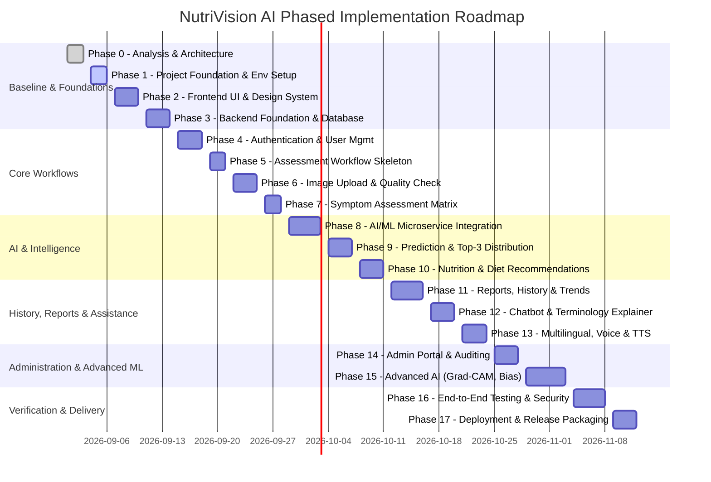

# NutriVision AI – Development Roadmap

**Project Name:** NutriVision AI – AI-Based Vitamin Deficiency Identification and Nutrition Recommendation System  
**Version:** 1.0  
**Status:** Active Development Plan  
**Strategy:** Incremental, Modular, Test-Driven, Safety-First  

---

## Roadmap Overview

---

## Detailed Phase Specifications

### Phase 0: Project Analysis and Architecture
- **Objective:** Deep-dive analysis of PRD.md and reference materials, establishing technical architecture, specifications, database models, API contracts, and development boundaries.
- **Features Addressed:** All (F01–F30 architectural alignment).
- **Dependencies:** None.
- **Files/Modules Involved:** `PRD.md`, `ARCHITECTURE.md`, `DEVELOPMENT_ROADMAP.md`, `FEATURE_TRACKER.md`, `DATABASE_DESIGN.md`, `API_SPECIFICATION.md`, `docs/IMPLEMENTATION_RULES.md`.
- **Testing Requirements:** Review against all safety requirements, terminology checks (Model Confidence, Disclaimers), verification of zero paid dependencies.
- **Completion Criteria:** All architectural documents authored, reviewed, and approved.

---

### Phase 1: Project Foundation and Environment Setup
- **Objective:** Create the complete clean repository folder hierarchy, environment configuration templates, `.gitignore`, and base configuration files for frontend, backend, and AI service.
- **Features Addressed:** Foundational infrastructure.
- **Dependencies:** Phase 0.
- **Files/Modules Involved:** `.gitignore`, `README.md`, `frontend/.env.example`, `backend/.env.example`, `ai-service/.env.example`, directory structures for datasets, models, uploads, tests.
- **Testing Requirements:** Folder structure verification, configuration parser tests.
- **Completion Criteria:** Clean directory structure established, all `.env.example` templates in place, git repository cleanly configured.

---

### Phase 2: Frontend Foundation and UI Design System
- **Objective:** Initialize the React 18 + Vite + TypeScript application with Tailwind CSS, Lucide icons, responsive layout shells, navigation, global color palettes (emerald/teal healthcare theme with dark mode), and base component library.
- **Features Addressed:** Base UI for F01–F30, Navigation, Responsive Layouts.
- **Dependencies:** Phase 1.
- **Files/Modules Involved:** `frontend/src/App.tsx`, `frontend/src/main.tsx`, `frontend/src/components/layout/*`, `frontend/src/components/common/*`, `frontend/src/styles/index.css`.
- **Testing Requirements:** Component unit tests (Vitest/Testing Library), responsiveness across mobile, tablet, and desktop viewports.
- **Completion Criteria:** Frontend builds cleanly, dev server runs with zero errors, design system tokens and navigation shell operational.

---

### Phase 3: Backend Foundation and MySQL Database
- **Objective:** Initialize Spring Boot 3.x backend application with Maven/Gradle, configure HikariCP connection to MySQL 8.0, set up JPA entity mappings, repositories, and Liquibase/Flyway or clean schema initialization scripts.
- **Features Addressed:** Persistence foundation for F15, F26, F27, F28.
- **Dependencies:** Phase 1, `DATABASE_DESIGN.md`.
- **Files/Modules Involved:** `backend/pom.xml` or `build.gradle`, `backend/src/main/resources/application.yml`, `backend/src/main/java/com/nutrivision/entity/*`, `backend/src/main/java/com/nutrivision/repository/*`, `database/schema.sql`.
- **Testing Requirements:** JPA test harness against in-memory/local MySQL test container, schema validation tests.
- **Completion Criteria:** Spring Boot application boots successfully, database tables automatically verified and connected.

---

### Phase 4: Authentication and User Management
- **Objective:** Implement secure user registration, login, JWT token issuance, refresh flow, BCrypt password hashing, and role-based access control (`ROLE_USER`, `ROLE_ADMIN`).
- **Features Addressed:** F26 (Secure User Data), User Profile management.
- **Dependencies:** Phase 2, Phase 3.
- **Files/Modules Involved:** `backend/src/main/java/com/nutrivision/security/*`, `backend/src/main/java/com/nutrivision/controller/AuthController.java`, `frontend/src/pages/auth/*`, `frontend/src/services/authService.ts`.
- **Testing Requirements:** Unit tests for BCrypt hasher and JWT generator; integration tests for `/api/auth/register`, `/api/auth/login`, and token-protected endpoints.
- **Completion Criteria:** End-to-end registration and login functioning in UI; token stored securely; role-based route gating verified.

---

### Phase 5: Assessment Workflow Skeleton
- **Objective:** Build the multi-step assessment wizard guiding the user through body part selection, image upload step, symptom questionnaire, review, and results view.
- **Features Addressed:** F02 (Multi-Body-Part Analysis), Assessment session tracking.
- **Dependencies:** Phase 4.
- **Files/Modules Involved:** `frontend/src/pages/assessment/*`, `frontend/src/components/assessment/*`, `backend/src/main/java/com/nutrivision/controller/AssessmentController.java`, `backend/src/main/java/com/nutrivision/service/AssessmentService.java`.
- **Testing Requirements:** Multi-step wizard state management tests, draft assessment creation and step progression integration tests.
- **Completion Criteria:** User can select target body part (skin, eyes, tongue, lips, nails, hair, face) and navigate step-by-step through wizard.

---

### Phase 6: Image Upload and Image Quality Checking
- **Objective:** Implement single and multiple image upload, browser camera frame capture (F21), server-side storage handling, and automated image quality checking (blur, darkness, resolution).
- **Features Addressed:** F03 (Multiple Image Upload), F04 (AI Image Quality Checking), F21 (Real-Time Camera Capture).
- **Dependencies:** Phase 5.
- **Files/Modules Involved:** `ai-service/app/services/quality_service.py`, `ai-service/app/routers/quality.py`, `backend/src/main/java/com/nutrivision/service/ImageStorageService.java`, `frontend/src/components/assessment/ImageUploader.tsx`, `frontend/src/components/assessment/CameraCaptureModal.tsx`.
- **Testing Requirements:** OpenCV blur/brightness heuristic tests with sample blurry/dark/normal images; rejection and acceptance flow tests.
- **Completion Criteria:** Blurry or dark images rejected with clear guidance; high quality images accepted and stored; camera capture works seamlessly.

---

### Phase 7: Symptom Assessment Matrix
- **Objective:** Implement the structured symptom questionnaire mapped to specific deficiency classes, with multi-select checkboxes, body-part specific symptom filters, and symptom vector serialization.
- **Features Addressed:** F07 (Symptom-Based Assessment).
- **Dependencies:** Phase 5.
- **Files/Modules Involved:** `frontend/src/components/assessment/SymptomQuestionnaire.tsx`, `backend/src/main/java/com/nutrivision/service/SymptomService.java`, `backend/src/main/java/com/nutrivision/entity/Symptom.java`, `database/seed_symptoms.sql`.
- **Testing Requirements:** Symptom mapping unit tests, questionnaire form validation tests.
- **Completion Criteria:** Rich symptom selector operational; symptom vectors correctly persisted and linked to assessments.

---

### Phase 8: AI/ML Microservice Integration
- **Objective:** Build the FastAPI inference service, image preprocessing pipeline (resizing, normalization, ROI), deep learning model loader, and secure inter-service communication client between Spring Boot and FastAPI.
- **Features Addressed:** F01 (Deficiency Detection), AI inference foundation.
- **Dependencies:** Phase 6, Phase 7.
- **Files/Modules Involved:** `ai-service/app/main.py`, `ai-service/app/services/model_service.py`, `ai-service/app/services/preprocess_service.py`, `backend/src/main/java/com/nutrivision/client/AIServiceClient.java`.
- **Testing Requirements:** FastAPI endpoint tests, preprocessing output tensor validation tests, Spring-to-FastAPI mock communication tests.
- **Completion Criteria:** Spring Boot successfully transmits multipart image + symptoms to FastAPI and receives structured prediction vectors.

---

### Phase 9: Prediction Results and Top-3 Predictions
- **Objective:** Calculate Softmax probability distributions, rank Top-3 candidate deficiencies, compute discrete Model Confidence percentages, map severity risk levels (Low, Moderate, Needs medical evaluation), and render the comprehensive assessment result view.
- **Features Addressed:** F01, F05 (Confidence Score), F06 (Top-3 Predictions), F13 (Severity/Risk-Level Indication).
- **Dependencies:** Phase 8.
- **Files/Modules Involved:** `ai-service/app/services/prediction_engine.py`, `backend/src/main/java/com/nutrivision/service/PredictionService.java`, `frontend/src/pages/assessment/AssessmentResultPage.tsx`, `frontend/src/components/assessment/Top3PredictionCard.tsx`.
- **Testing Requirements:** Probability distribution integrity tests (sum to 1.0), risk-level threshold tests, medical disclaimer presence assertion.
- **Completion Criteria:** Result page accurately displays Top-3 predictions with explicit "Model Confidence: XX%", clear risk level badge, and mandatory disclaimer.

---

### Phase 10: Food Recommendations and Nutrition Plans
- **Objective:** Implement curated dietary recommendation engine and 7-day nutrition planner filtered by user preferences (vegetarian, non-vegetarian, vegan, regional).
- **Features Addressed:** F08 (Personalized Food Recommendations), F09 (Personalized Nutrition Plan).
- **Dependencies:** Phase 9.
- **Files/Modules Involved:** `backend/src/main/java/com/nutrivision/service/RecommendationService.java`, `database/seed_nutrition.sql`, `frontend/src/components/recommendations/FoodRecommendationGrid.tsx`, `frontend/src/components/recommendations/WeeklyMealPlan.tsx`.
- **Testing Requirements:** Filter logic unit tests (assert no non-veg items under vegan filter), recommendation mapping validation tests.
- **Completion Criteria:** Users can filter food recommendations and view/print structured 7-day nutrition plans based on their assessment results.

---

### Phase 11: Reports, History and Progress Tracking
- **Objective:** Build dynamic PDF health report generation, chronological assessment history log with detail lookup, and interactive progress tracking charts showing risk and confidence trends over time.
- **Features Addressed:** F14 (Health Report Generation), F15 (User Assessment History), F16 (Progress Tracking).
- **Dependencies:** Phase 9, Phase 10.
- **Files/Modules Involved:** `backend/src/main/java/com/nutrivision/service/PdfReportService.java`, `frontend/src/pages/dashboard/HistoryPage.tsx`, `frontend/src/pages/dashboard/ProgressPage.tsx`, `frontend/src/components/charts/TrendChart.tsx`.
- **Testing Requirements:** PDF layout and disclaimer verification, history pagination tests, Recharts time-series data rendering tests.
- **Completion Criteria:** Downloadable PDF report with verbatim disclaimer generated; user can browse past assessments and view progress trend charts.

---

### Phase 12: Chatbot and Medical-Term Explanation
- **Objective:** Implement the educational AI chatbot with rule-based/FAQ guardrails answering vitamin, symptom, and nutrition queries, plus plain-language tooltip/glossary popups for complex clinical terms.
- **Features Addressed:** F10 (AI Chatbot), F11 (Medical-Term Explanation), F12 (Doctor Referral System with Leaflet OpenStreetMap).
- **Dependencies:** Phase 9.
- **Files/Modules Involved:** `backend/src/main/java/com/nutrivision/service/ChatbotService.java`, `frontend/src/components/chatbot/ChatbotWidget.tsx`, `frontend/src/components/common/MedicalGlossaryModal.tsx`, `frontend/src/components/referrals/DoctorReferralMap.tsx`.
- **Testing Requirements:** Chatbot guardrail tests (preventing diagnosis claims), medical term lookup tests, Leaflet map rendering tests.
- **Completion Criteria:** Chatbot provides safe educational guidance with mandatory disclaimer on start; medical terms have one-click explanations; doctor referral suggestions render on map.

---

### Phase 13: Multilingual and Accessibility Features
- **Objective:** Configure `react-i18next` with complete translation catalogs (English, Kannada, Hindi, Telugu, Tamil), integrate browser Web Speech API for voice symptom input, and browser SpeechSynthesis for text-to-speech reading.
- **Features Addressed:** F17 (Multilingual Support), F18 (Voice-Based Interaction), F19 (Text-to-Speech).
- **Dependencies:** Phase 2, Phase 7, Phase 9.
- **Files/Modules Involved:** `frontend/src/i18n/*`, `frontend/src/locales/*`, `frontend/src/hooks/useSpeechRecognition.ts`, `frontend/src/hooks/useSpeechSynthesis.ts`, `frontend/src/components/common/VoiceInputButton.tsx`.
- **Testing Requirements:** Language switcher tests across key views, speech API fallback tests for unsupported browsers.
- **Completion Criteria:** Seamless UI language switching across 5 languages; voice dictation works on supported browsers with graceful fallback; text-to-speech reads results.

---

### Phase 14: Admin Dashboard
- **Objective:** Create the dedicated administrative portal for managing users, monitoring real-time assessment volume, viewing prediction analytics, triaging user feedback, and maintaining dataset/model records.
- **Features Addressed:** F27 (Admin Dashboard), F28 (Feedback System).
- **Dependencies:** Phase 4, Phase 9, Phase 10.
- **Files/Modules Involved:** `frontend/src/pages/admin/*`, `frontend/src/components/admin/*`, `backend/src/main/java/com/nutrivision/controller/AdminController.java`, `backend/src/main/java/com/nutrivision/service/AdminService.java`.
- **Testing Requirements:** Role-gating security tests (403 Forbidden for non-admin users), feedback aggregation tests.
- **Completion Criteria:** Admin dashboard gives complete visibility over users, system assessments, feedback ratings, and model usage.

---

### Phase 15: Advanced AI Features
- **Objective:** Implement Grad-CAM saliency map generation on the active CNN architecture, dynamic model artifact management (F23), dataset lineage registration (F22), and stratified bias/diversity evaluation across demographic dimensions (F25).
- **Features Addressed:** F22 (Dataset Expansion), F23 (Model Improvement), F24 (Grad-CAM Explainability), F25 (Bias and Diversity Analysis).
- **Dependencies:** Phase 8, Phase 14.
- **Files/Modules Involved:** `ai-service/app/services/gradcam_service.py`, `ai-service/app/services/bias_service.py`, `frontend/src/components/assessment/GradCamViewer.tsx`, `frontend/src/pages/admin/AdminBiasAnalysisPage.tsx`.
- **Testing Requirements:** Grad-CAM heatmap generation test on sample tensors; bias analysis metric computation tests.
- **Completion Criteria:** Grad-CAM overlay visible in result view; admin can review model version metrics and inspect bias/diversity breakdowns.

---

### Phase 16: Testing and Security
- **Objective:** Conduct rigorous end-to-end integration testing, security hardening (CSRF, XSS, rate-limiting, SQLi prevention, token revocation), and verify all 30 PRD acceptance criteria.
- **Features Addressed:** F26 (Secure User Data), system-wide quality assurance.
- **Dependencies:** Phases 1–15.
- **Files/Modules Involved:** `tests/integration/*`, `tests/e2e/*`, `backend/src/test/*`, `frontend/src/__tests__/*`.
- **Testing Requirements:** Full automated test suite execution, security vulnerability scan, end-to-end user journey simulation.
- **Completion Criteria:** All test suites passing; zero high-severity security vulnerabilities; medical disclaimer assertions 100% verified.

---

### Phase 17: Deployment Preparation
- **Objective:** Prepare production-ready Dockerfiles for frontend, backend, and AI service; build comprehensive `docker-compose.yml` for unified local/server orchestration; write production operations manual.
- **Features Addressed:** F30 (Cloud Deployment / Containerization Baseline).
- **Dependencies:** Phase 16.
- **Files/Modules Involved:** `docker-compose.yml`, `frontend/Dockerfile`, `backend/Dockerfile`, `ai-service/Dockerfile`, `docs/DEPLOYMENT_GUIDE.md`.
- **Testing Requirements:** Full stack boot test via single `docker-compose up` command, health check validation.
- **Completion Criteria:** Complete 3-tier system launches successfully in isolated containers with zero manual config errors.
